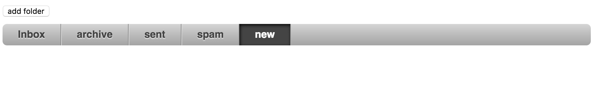

# 前言
基本数据双向绑定和数组双向绑定掌握了之后，实际应用中50%的场景应该可以支持了。
接下来就来完成官方Tutorial第三站：Single Page Application吧

## Building a webMail client
通过创建一个邮箱的案例来实现Single Page Application

## 创建邮箱的文件夹
``` HTML
<!-- 最基本的无序列表，加上一个简单的样式 -->
<ul class="folders" data-bind="foreach: folders">
    <li data-bind="text:$data" ></li>
</ul>

<script>
	// 最基本的单向数据绑定
	function WebmailViewModel() {
    // Data
    var self = this;
    self.folders = ['Inbox', 'Archive', 'Sent', 'Spam'];
};

ko.applyBindings(new WebmailViewModel());
</script>
```
再为其增加点击事件，和选中后的样式
``` HTML
<ul class="folders" data-bind="foreach: folders">
    <li data-bind="text:$data,
                   css:{selected: $data == $root.chosenFolderItem()},
                   click: $root.goToFolder" ></li>
</ul>
<script>
	function WebmailViewModel() {
    // Data
    var self = this;
    self.folders = ['Inbox', 'Archive', 'Sent', 'Spam'];
    self.chosenFolderItem = ko.observable();
    
    self.goToFolder = function(folder){
        self.chosenFolderItem(folder);
    };
};

ko.applyBindings(new WebmailViewModel());
</script>
```
实现效果如图所示：


## 选中文件夹显示该文件夹下的所有邮件
接下来完善点击文件夹的功能。
在点击不同的文件夹之后，出来将文件夹设置为选中状态外，同时显示该文件夹内的邮件
```HTML
<!-- 这里使用with绑定，这样在table内部所有的数据绑定都是with指定的数据 -->
<table class="mails" data-bind="with:chosenFolderData">
		<thead><tr><th>From</th><th>To</th><th>Subject</th><th>Date</th></tr></thead>
		<tbody data-bind="foreach:mails">
			<tr>
				<td data-bind="text: from"></td>
				<td data-bind="text: to"></td>
				<td data-bind="text: subject"></td>
				<td data-bind="text: date"></td>
			</tr>     
		</tbody>
	</table>
<script>
	// 懒得做api了，就直接在js内部模拟ajax获取数据了
	// 以下只是一部分dummy数据，具体见源码
	var mails=[
		{
			"id": "Inbox",
			"mails": [
			{
				"id": 1,
				"from": "Abbot <oliver@smoke-stage.xyz>",
				"to": "steve@example.com",
				"date": "May 25, 2011",
				"subject": "Booking confirmation #389629244",
				"folder": "Inbox"
			}]};
	// 根据选中文件夹的名称获取相对应的邮件列表
	var filterMails = function(id){
			return mails.filter(function(item){return item.id == id;});
		};

		self.goToFolder = function(folder){
				self.chosenFolderId(folder);
				 // 在goToFolder方法中增加加载self.chosenFolderData的方法
				 if(folder){
				 	var temp = filterMails(folder.name);
				 	// 上述方法因为使用的是filter，因此返回的数组，所以需要用temp[0]
				 	self.chosenFolderData(temp[0]);	
				 }				 
			};
			// 设置chosenFolderData为双向数据绑定
			self.chosenFolderData = ko.observable();
			// 页面初次加载默认选中第一个文件夹
			self.goToFolder(self.folders()[0]);
</script>
```
这样就实现了选中不同的文件夹加载该文件夹下所有邮件的功能。

## 点击邮件显示邮件内容
```html
	<!-- Chosen mail -->
	<div class="viewMail" data-bind="with: chosenMailData">
		<div class="mailInfo">
			<h1 data-bind="text: subject"></h1>
			<p><label>From</label>: <span data-bind="text: from"></span></p>
			<p><label>To</label>: <span data-bind="text: to"></span></p>
			<p><label>Date</label>: <span data-bind="text: date"></span></p>
		</div>
		<p class="message" data-bind="html: messageContent" />
	</div>
<script>
	// viewModel中增加goToMail方法
	// 将chosenFolderData设为空，table就不会再显示了
	// 同理，在goToFolder时也要将chosenMailData设为空
	self.goToMail = function(mail){
					self.chosenFolderId(mail.folder);
					self.chosenFolderData(null);
					self.chosenMailData(emailContent);
				};
</script>
```

## 结尾
Single Page Application就到此结束了，官网的demo中还引用了sammy.js以实现路由等高级功能
就不多做研究了，如果需要这些，就直接用angular了

[源码](https://github.com/nicky-lau/Knockoutjs/tree/master/SinglePageApp)