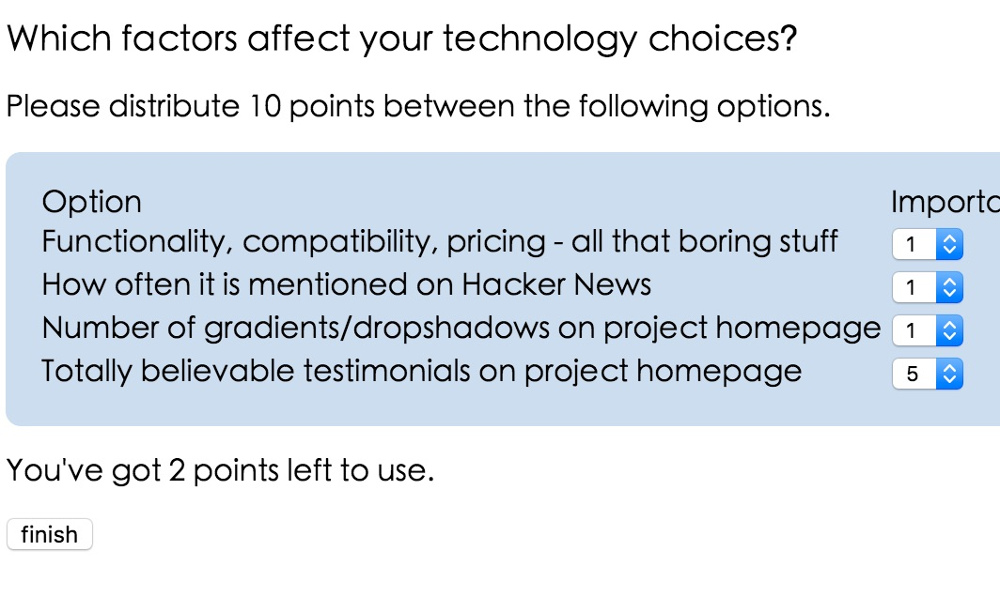
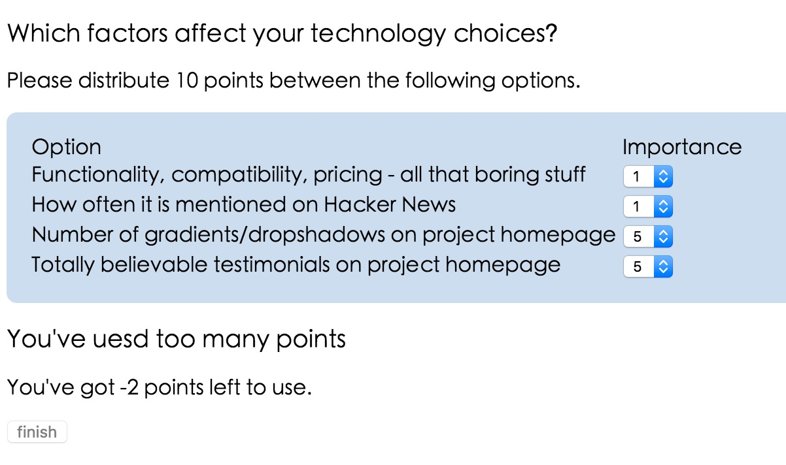

# 前言
简单的Single Page Application的Demo完成之后，ko的官网给出了进阶的教程，就是Creating custom bindings。
也就是说，除了ko自带的这些"text"，"value","foreach"绑定方式之外，还可以自己扩展绑定的方式。
接下来就来看看如何实现
 
## 原始ko绑定
先利用之前的知识，做一个简单的Survey页面。
这个页面的题目，选项，以及每道题目的得分都是动态绑定的。
下面先来实现这个页面：
```HTML
<h3 data-bind="text:questionName"></h3>
<p>Please distribute <b data-bind="text:pointsBudget"></b> points between the following options.</p>
<table>
	<thead><tr><th>Option</th><th>Importance</th></tr></thead>
	<tbody data-bind="foreach:answers">
		<tr>
			<td data-bind="text:answerText"></td>
			<td><select data-bind="options:$root.pointDataSource,value:points"></select></td>
		</tr>
	</tbody>
</table>
<h3 data-bind="visible:pointUsed()>pointsBudget">You've uesd too many points</h3>
<p>You've got <b data-bind="text:pointsBudget-pointUsed()"></b> points left to use.</p>
<button data-bind="enable:pointUsed()<=pointsBudget,click:save">finish</button>


<script src="https://cdn.bootcss.com/jquery/1.11.3/jquery.min.js"></script>
<script src="../knockoutjs.js"></script>
<script>
	var Answer = function(text){
		this.answerText = text;
		this.points = ko.observable(1);
	};

	var SurveyViewModel = function(questionName,pointsBudget,answers){
		var self = this;
		self.pointDataSource = [1,2,3,4,5];
		self.questionName = questionName;
		self.pointsBudget = pointsBudget;
		self.answers = $.map(answers,
			function(text){
				return new Answer(text);
			});

		self.pointUsed = ko.computed(function(){
			var total = 0,
			i = 0,
			answerLength = self.answers.length;
			for(;i<answerLength;i++){
				total += self.answers[i].points();
			}
			return total;
		},self);
		self.save = function(){
			alert("to do!");
		};
	};

	ko.applyBindings(new SurveyViewModel("Which factors affect your technology choices?", 10, 
		["Functionality, compatibility, pricing - all that boring stuff",
		"How often it is mentioned on Hacker News",    
		"Number of gradients/dropshadows on project homepage",        
		"Totally believable testimonials on project homepage"
		]));
	</script>
```
效果如下:
当选择的分数小于可选总分数的时候，提示还剩余几分可选，同时finish按钮可用

当选择的分数大于可选总分数的时候，增加一行提示说选择的分数太多了，同时finish按钮不可用

 
用官网的话说，现在的页面实在没什么好看的，
>Now let's improve the look and feel in three ways:
... with an animated transition on the "You've used too many points" warning
... with improved styling on the Finished button
... with a fun-to-use star-rating display for assigning points, instead of the annoying drop-down lists

## Custom Binding
接下来使用custom binding来做三点修改：
 1. 为警告框增加动画效果
 2. 给finish按钮增加样式
 3. 用⭐️打分的方式替代下拉框

### 为警告框增加动画效果
可以看到在使用原始绑定时，"You've used too many points"这句话是用简单的visible绑定实现的。
那么怎么给这个很突兀的"visible"增加点动画效果呢？比如使用jQuery的fadeIn和fadeOut方法?
你可以通过向"ko.bingdingHandlers添加新的属性，来实现自定义绑定。你添加的新属性里面可以实现两个callback函数：
* init 当绑定第一次发生的时候（通常可以用来设置初始状态和注册event handler)
* update 当关联的数据发生变化时，都会触发这个function（因此可以在这里来控制dom来匹配数据的变化）

接下来就简单的实现添加一个名为fadeVisible的绑定：
``` html
// 首先，向ko.bingdingHandlers中添加名为fadeVisible的属性
ko.bindingHandlers.fadeVisible = {
			// 添加初始状态
			init:function(element,valueAccessor){
				// 接收绑定的值
				var shouldDisplay = valueAccessor();
				// 根据传入的值，通过调用$.toggle()来设置显示与否
				$(element).toggle(shouldDisplay);
			},
			// 设置更新状态
			update:function(element,valueAccessor){
				var shouldDisplay = valueAccessor();
				// 如果传入真值，则fadeIn,传入假值，则fadeOut
				shouldDisplay?$(element).fadeIn():$(element).fadeOut();
			}
		};
```
这样在html将visible绑定替换为新定义的fadeVisible绑定，即可实现效果。

### 集成第三方组件
官网的教程是使用集成jQueryUI,将button变为jQueryUI的button，我觉得太老土了，于是使用了bootstrap的tooltip.js控件，为finish按钮增加一些说明，用法也很简单：
``` javascript
	ko.bindingHandlers.bsButton = {
			init:function(element,valueAccessor){
				if(valueAccessor()){
					$(element).tooltip('show');
				}
			}
		};
```
### 集成自定义插件
最后这个比较复杂，使用星号来替换下拉框实现打分。
直接看实现吧：
``` javascript
ko.bindingHandlers.starRating = {
    init: function(element, valueAccessor) {
        $(element).addClass("starRating");
        for (var i = 0; i < 5; i++)
           $("<span>").appendTo(element);
       
        // Handle mouse events on the stars
        $("span", element).each(function(index) {
            $(this).hover(
                function() { $(this).prevAll().add(this).addClass("hoverChosen") }, 
                function() { $(this).prevAll().add(this).removeClass("hoverChosen") }                
            ).click(function() { 
                var observable = valueAccessor();  // Get the associated observable
                observable(index+1);               // Write the new rating to it
            });
        });            
    },
    update: function(element, valueAccessor) {
        // Give the first x stars the "chosen" class, where x <= rating
        var observable = valueAccessor();
        $("span", element).each(function(index) {
            $(this).toggleClass("chosen", index < observable());
        });
    }    
};
```

最后还是老样子：[源码](https://github.com/nicky-lau/Knockoutjs/tree/master/CustomBindings)
